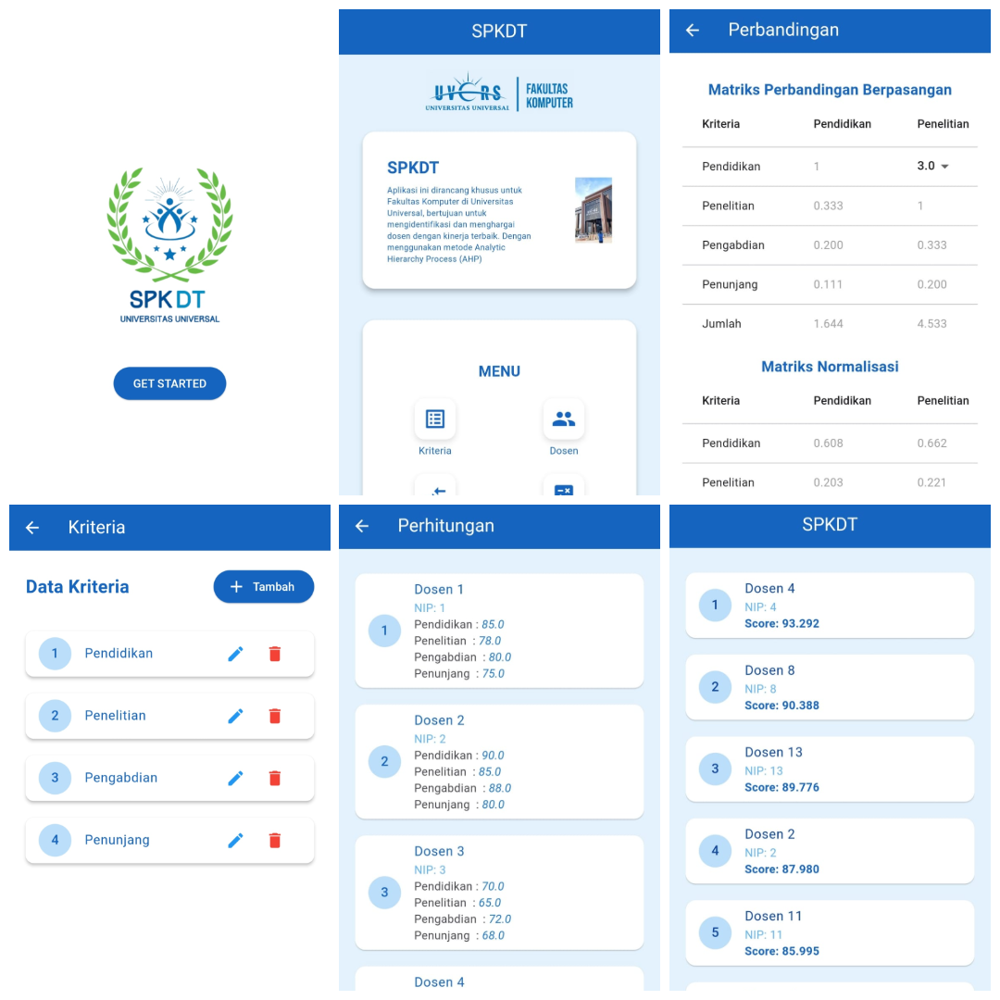

# SPKDT - Decision Support System (AHP Method)

SPKDT (Best Lecturer Decision Support System) is an application developed to assist educational institutions in selecting the best lecturer through an objective and structured evaluation process. The system implements the Analytical Hierarchy Process (AHP) method to calculate and assess lecturer performance based on multiple predefined criteria.

Through this application, users can manage lecturer data, define evaluation criteria and weights, conduct assessments, and automatically generate lecturer rankings. The system is designed to improve evaluation efficiency, reduce subjectivity, and support institutions in making more accurate and transparent decisions.

This project was developed as a practical implementation of Decision Support System concepts within the field of Information Systems by combining mobile technology with multi-criteria decision-making methods.

## 📸 Website Preview

## 🛠️ Tech Stack & Tools

- Frontend : Flutter, Dart
- Method : Analytical Hierarchy Process (AHP)
- Tools : Visual Studio Code, Android Studio,

## 🚀 How to Run the Project

Download or clone this repository.
- Download or clone this repository.
- Open the project using Visual Studio Code or Android Studio.
- Install all required dependencies.
- Connect an Android emulator or physical device.
- Run the application.
- Use the lecturer evaluation features and view the ranking results generated by the system.
